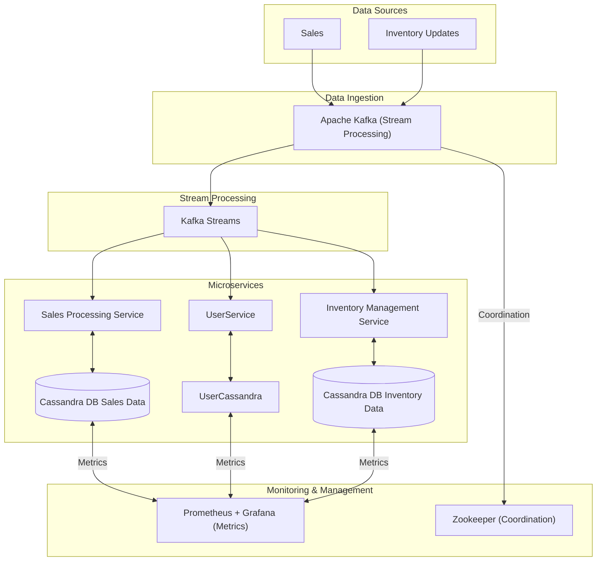

```mermaid
flowchart TB
    subgraph "Data Sources"
        Transactions["Sales"]
        InventoryUpdates["Inventory Updates"]
    end

    subgraph "Data Ingestion"
        Kafka["Apache Kafka (Stream Processing)"]

        Transactions --> Kafka
        InventoryUpdates --> Kafka
        
    end

    subgraph "Stream Processing"
        KafkaStreams["Kafka Streams"]
       
        Kafka --> KafkaStreams
    end

    subgraph "Microservices"
        SalesService["Sales Processing Service"]
        InventoryService["Inventory Management Service"]
        
        SalesCassandra[(Cassandra DB Sales Data)]
        InventoryCassandra[(Cassandra DB Inventory Data)]
        
        UserService <--> UserCassandra
        SalesService <--> SalesCassandra
        InventoryService <--> InventoryCassandra
        
        KafkaStreams --> UserService
        KafkaStreams --> SalesService
        KafkaStreams --> InventoryService
      
    end
    
    subgraph "Monitoring & Management"
        Prometheus["Prometheus + Grafana (Metrics)"]
        Zookeeper["Zookeeper (Coordination)"]
        
        Kafka -- "Coordination" --> Zookeeper
        
        SalesCassandra <-- "Metrics" --> Prometheus
        UserCassandra <-- "Metrics" --> Prometheus
        InventoryCassandra <-- "Metrics" --> Prometheus
    end
```