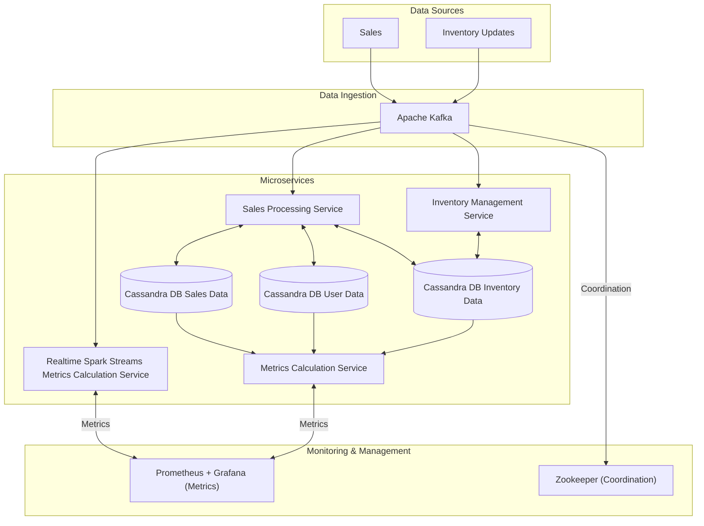
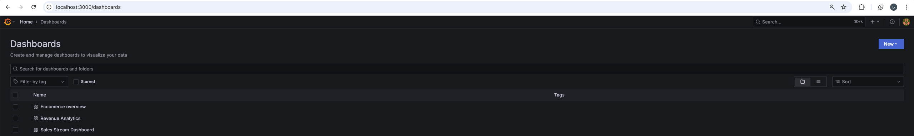
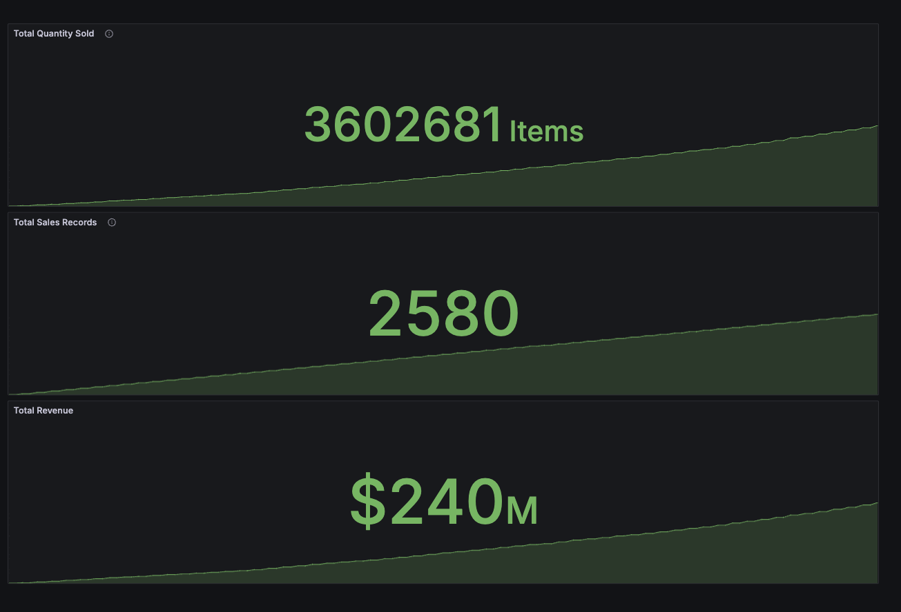
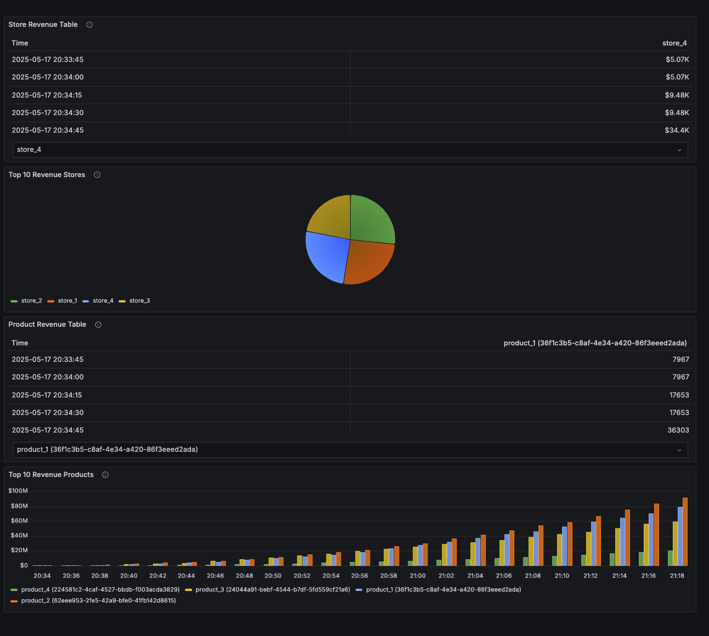
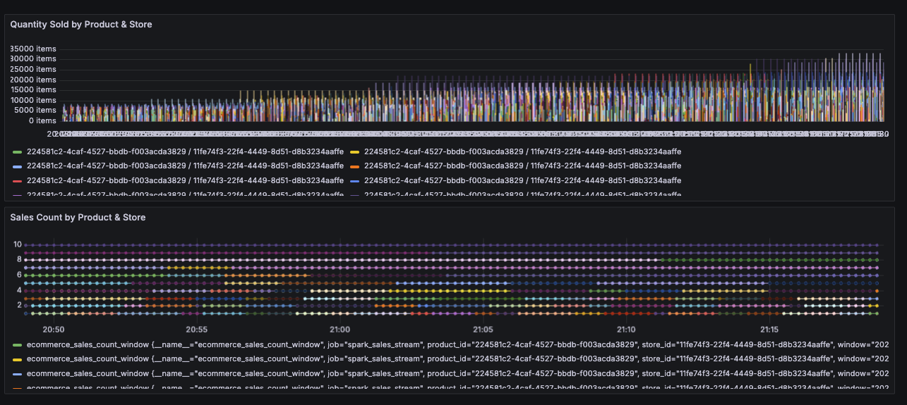

# E-commerce Platform

**Authors:**  
Pavliuk Bohdan & Samoilenko Marta

**Description:**  
We introduce a basic e-commerce platform that allows you to track valuable data throughout all commercial processes. You can add and monitor all transactions related to your sales.


## Architecture schema



## Available Metrics

### Ecommerce Overview:
- **Total Quantity Sold** – Tracks all items that have been sold.
- **Total Sales Records** – Tracks the total number of sales performed.
- **Total Revenue** – Tracks the total revenue earned.

### Revenue Analytics:
- **Store Revenue Table** – Tracks the revenue of each store at each timestamp.
- **Top 10 Revenue Stores** – Tracks the most valuable stores by revenue.
- **Product Revenue Table** – Tracks the revenue of each product at each timestamp.
- **Top 10 Revenue Products** – Tracks the revenue of the most sold products.

### Sales Stream Dashboard:
- **Quantity Sold by Product & Store** – Tracks how many items of each product were sold in each store.
- **Sales Count by Product & Store** – Tracks the number of sales of each product in each store.

---

## How to Use Our Platform

As a core project, we use synthetic data generation (since no real sales are available), which is added to our Cassandra database. All monitoring is visualized through the Grafana UI.

To start, run in the terminal:

```sh
docker compose up --build -d
```

Once the server is running, you can access [Grafana](http://localhost:3000) on your localhost.

  
Here, you can interact with all available metrics.

---

## Tracking Metrics (Results)

### Ecommerce Overview:


### Revenue Analytics:


### Sales Stream:



