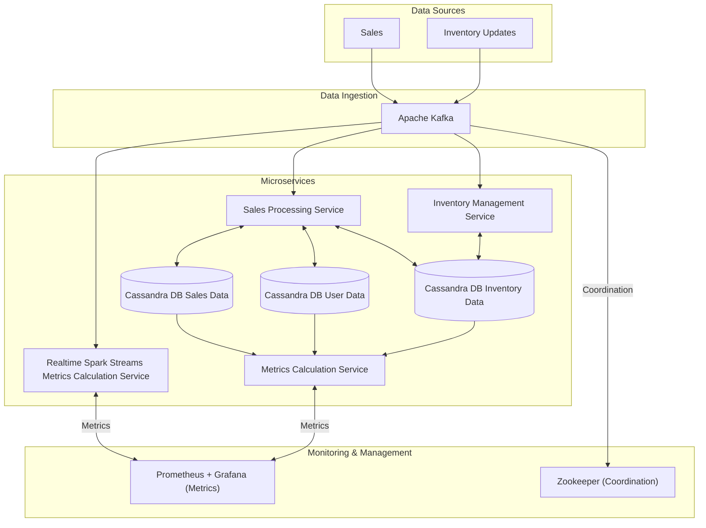

```mermaid
flowchart TB
    subgraph "Data Sources"
        Transactions["Sales"]
        InventoryUpdates["Inventory Updates"]
    end

    subgraph "Data Ingestion"
        Kafka["Apache Kafka"]

        Transactions --> Kafka
        InventoryUpdates --> Kafka
        
    end


    subgraph "Microservices"
        SalesService["Sales Processing Service"]
        InventoryService["Inventory Management Service"]
        StreamsService["Realtime Spark Streams Metrics Calculation Service"]
        
        SalesCassandra[(Cassandra DB Sales Data)]
        InventoryCassandra[(Cassandra DB Inventory Data)]
        UserCassandra[(Cassandra DB User Data)]
        
        SalesService <--> SalesCassandra
        SalesService <--> UserCassandra
        SalesService <--> InventoryCassandra
        

        InventoryService <--> InventoryCassandra
        
        Kafka --> StreamsService
        Kafka --> SalesService
        Kafka --> InventoryService

        ExporterService["Metrics Calculation Service"]

        SalesCassandra --> ExporterService
        InventoryCassandra --> ExporterService
        UserCassandra --> ExporterService
      
    end
    
    subgraph "Monitoring & Management"
        Prometheus["Prometheus + Grafana (Metrics)"]
        Zookeeper["Zookeeper (Coordination)"]
        
        Kafka -- "Coordination" --> Zookeeper
        
        ExporterService <-- "Metrics" --> Prometheus
        StreamsService <-- "Metrics" --> Prometheus
    end
```
